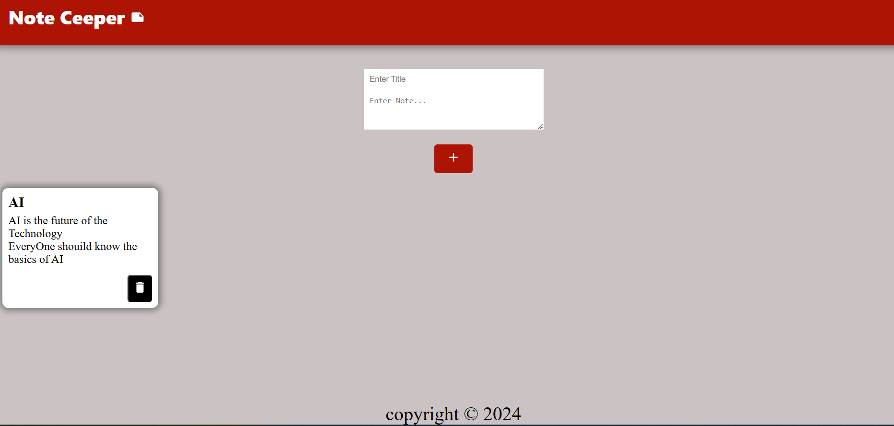

Description : 
This is a project build to maintain  a daily notes Keeper 

The Technology i have used is "React" 

The project includes the basic function like :-
-> Adding a New Note
-> Viewing The Note
-> Deleteing a Added Note

App Components :
->App
    ->Header
    ->Input
    ->Note
    ->Footer

For icons i used 
<!-- "https://mui.com/material-ui/material-icons/" -->

We need instal the required dependencies

<!-- npm install @mui/material @emotion/react @emotion/styled
npm install @mui/material @mui/styled-engine-sc styled-components
npm install @fontsource/roboto
npm install @mui/icons-material
-->
Then we need to link  

<!-- <link
  rel="stylesheet"
  href="https://fonts.googleapis.com/icon?family=Material+Icons"
/> -->

Then we need to import 

<!-- import DeleteIcon from '@mui/icons-material/Delete'; -->

Then we can use it as an icon by react component 
<!-- <DeleteIcon /> -->

For Background images i may use 
<!--transparenttectures.com -->